# AWS VPC テンプレートプロジェクト

このプロジェクト は、AWS 環境における VPC 構築のベースラインテンプレートプロジェクトです。NAT Bastion を活用したコスト効率の良いネットワーク構成を提供します。

## 概要

このプロジェクトは、以下の特徴を持つ AWS VPC 環境を構築します。

- Multi-AZ 対応の VPC 構成
- Public/Private サブネットの自動セグメンテーション
- EC2 ベースの NAT Bastion(コスト削減)
- VPC エンドポイント(S3/DynamoDB)
- プライベートホストゾーン(Route53)
- 自動生成される SSH キーペア
- SSM 対応の管理機能

## アーキテクチャ

```mermaid
graph TB
    subgraph "VPC (10.0.0.0/16)"
        subgraph "Public Subnet"
            IGW[Internet Gateway]
            BASTION[NAT Bastion<br/>EC2 Instance]
        end

        subgraph "Private Subnet AZ-1a"
            WORK1[Workload Instance]
        end

        subgraph "Private Subnet AZ-1c"
            WORK2[Workload Instance]
        end

        subgraph "Private Subnet AZ-1d"
            WORK3[Workload Instance]
        end

        VPCE_S3[VPC Endpoint<br/>S3]
        VPCE_DDB[VPC Endpoint<br/>DynamoDB]
        R53[Route53<br/>Private Zone]
    end

    Internet((Internet))

    Internet <--> IGW
    IGW <--> BASTION
    BASTION --> WORK1
    BASTION --> WORK2
    BASTION --> WORK3

    WORK1 -.-> VPCE_S3
    WORK2 -.-> VPCE_DDB
    WORK1 -.-> R53
    WORK2 -.-> R53
    WORK3 -.-> R53
```



## 構成モジュール

### network モジュール(統合モジュール)

VPC に関連する全てのリソースを一元管理する統合モジュールです。

#### vpc.tf

VPC、サブネット、ルートテーブル、VPC エンドポイント、Route53 プライベートホストゾーンを管理します。

- VPC 作成と DNS 設定
- Public/Private サブネットの作成(各 AZ)
- Internet Gateway
- ルートテーブルとアソシエーション
- VPC エンドポイント(S3/DynamoDB)
- プライベートホストゾーン

#### security.tf

キーペア、セキュリティグループ、IAM ロール/インスタンスプロフィールを管理します。

- ED25519 秘密鍵の自動生成
- EC2 キーペアの作成(natbastion/workload)
- NAT Bastion 用セキュリティグループ
- SSM 管理用 IAM ロールとインスタンスプロフィール

#### natbastion.tf

NAT 機能を持つ Bastion インスタンスを管理します。

- NAT Bastion インスタンスの作成
- Elastic IP の割り当て
- プライベートサブネット用ルート設定
- Route53 レコード登録(natbastion.internal)

## セットアップ手順

### 1. 設定ファイルの準備

terraform.tfvars.example をコピーして、terraform.tfvars を作成します。

```bash
cd terraform
cp terraform.tfvars.example terraform.tfvars
```

### 2. 必須変数の設定

terraform.tfvars を編集して、必須変数を設定します。

```hcl
owner_name   = "your-name"
project_name = "your-project"
```

### 3. オプション変数の調整

必要に応じて、以下の変数を調整します。

```hcl
aws_region   = "ap-northeast-1"
az_count     = "3"
vpc_cidr     = "10.0.0.0/16"
domain_name  = "internal"

natbastion_instance = {
  instance_type    = "t4g.nano"
  architecture     = "arm64"
  az_2word         = "1a"
  root_volume_size = 20
}

iscreate_key_bastion  = true
iscreate_key_workload = true
```

### 4. Terraform の実行

```bash
terraform init
terraform plan
terraform apply
```

### 5. 秘密鍵の取得

apply が完了すると、iscreate_key フラグを true に設定している場合、以下の秘密鍵ファイルが生成されます。

- `natbastion.pem`: NAT Bastion インスタンス接続用
- `workload.pem`: ワークロードインスタンス接続用

注: デフォルトでは両フラグとも false のため、ファイルは生成されません。必要に応じて terraform.tfvars で有効化してください。

### 6. NAT Bastion への接続

```bash
chmod 600 natbastion.pem
ssh -i natbastion.pem ec2-user@<natbastion-eip>
```

NAT Bastion EIP は、terraform output で確認できます。

```bash
terraform output connect_from_inet
```

## ネットワーク設計

### CIDR 構成

デフォルトの VPC CIDR: `10.0.0.0/16`

| タイプ  | AZ  | CIDR          |
| ------- | --- | ------------- |
| Public  | 1a  | 10.0.1.0/24   |
| Public  | 1c  | 10.0.2.0/24   |
| Public  | 1d  | 10.0.3.0/24   |
| Private | 1a  | 10.0.129.0/24 |
| Private | 1c  | 10.0.130.0/24 |
| Private | 1d  | 10.0.131.0/24 |

### ルーティング


- **Public Subnet**: Internet Gateway 経由で直接インターネットへ
- **Private Subnet**: NAT Bastion 経由でインターネットへ(各 AZ 個別のルートテーブル)

## セキュリティ考慮事項

### Bastion インスタンスのセキュリティ機能

Bastion インスタンスには、以下のセキュリティ機能が実装されています。

1. **fail2ban**: SSH 接続試行回数制限

   - デフォルトバン時間: 3600 秒(1 時間)
   - SSH 試行回数: 3 回(300 秒以内)

2. **SSH 設定の制限**

   - ポートフォワーディングのみ許可
   - TTY 無効化
   - コマンド実行不可
   - X11 フォワーディング無効
   - エージェントフォワーディング無効

3. **NAT 機能**
   - iptables による NAT 設定
   - IP Forwarding の有効化

### セキュリティグループ

Bastion セキュリティグループは、以下のルールを持ちます。

- **Ingress**:
  - SSH(22/tcp): 0.0.0.0/0 から許可
  - All: VPC CIDR から許可
- **Egress**:
  - All: 0.0.0.0/0 へ許可

### 推奨事項

本番環境では、以下のセキュリティ強化を検討してください。

- Bastion へのアクセス元 IP をホワイトリスト化
- AWS Systems Manager Session Manager の利用
- 多要素認証(MFA)の導入
- セキュリティグループのさらなる制限

## AMI 管理

### サポート AMI

以下の AMI をサポートしています。

- Amazon Linux 2023 (AMD64/ARM64)
- Ubuntu 24.04 LTS (AMD64/ARM64)

### AMI 選択方法

#### 動的 AMI 取得(デフォルト)

terraform.tfvars で static\_\*変数を指定しない場合、AWS SSM Parameter Store から最新 AMI を自動取得します。

#### 静的 AMI 指定

terraform.tfvars で以下の変数を設定することで、固定 AMI を使用できます。

```hcl
static_al2023_amd64 = "ami-xxxxxxxxxxxxxxxxx"
static_al2023_arm64 = "ami-xxxxxxxxxxxxxxxxx"
static_ubuntu_amd64 = "ami-xxxxxxxxxxxxxxxxx"
static_ubuntu_arm64 = "ami-xxxxxxxxxxxxxxxxx"
```

## リソース命名規則

全てのリソースは、以下の命名規則に従います。

```
{resource-type-prefix}-{resource-name}-{project_name}
```

### リソースプレフィックス一覧

| リソースタイプ       | プレフィックス | 例                           |
| -------------------- | -------------- | ---------------------------- |
| VPC                  | vpc-           | vpc-myproject                |
| Subnet               | sb-            | sb-pub1a-myproject           |
| Route Table          | rtb-           | rtb-pub-myproject            |
| Internet Gateway     | igw-           | igw-myproject                |
| Security Group       | sg-            | sg-natbastion-myproject      |
| EC2 Instance         | ec2-           | ec2-natbastion-myproject     |
| EIP                  | eip-           | eip-natbastion-myproject     |
| VPC Endpoint         | vpce-          | vpce-s3-myproject            |
| Route53 Zone         | rt53-zone-     | rt53-zone-myproject          |
| Key Pair             | kp-            | kp-natbastion-myproject      |
| IAM Role             | role-          | role-natbastion-myproject    |
| IAM Instance Profile | profile-       | profile-natbastion-myproject |
| EBS Volume           | ebs-           | ebs-natbastion-myproject     |

## コスト最適化

### NAT Bastion を使用する理由

AWS NAT Gateway は高額なため、このプロジェクトでは EC2 ベースの NAT Bastion を使用しています。

#### コスト比較(ap-northeast-1 の場合)

| サービス     | 月額コスト(概算)           |
| ------------ | -------------------------- |
| NAT Gateway  | 約$33(固定) + データ転送料 |
| t4g.nano EC2 | 約$3 + EIP 料金            |

#### トレードオフ

- **利点**: 大幅なコスト削減
- **欠点**: 単一 AZ 配置のため、AZ 障害時に影響を受ける

### さらなるコスト削減

必要に応じて、以下の対策を検討してください。

- 夜間・休日の Bastion インスタンス停止
- スポットインスタンスの活用
- より小さいインスタンスタイプの検討

## トラブルシューティング

### Private サブネットからインターネットに接続できない

1. NAT Bastion インスタンスが起動しているか確認
2. NAT Bastion インスタンスの source_dest_check が無効になっているか確認
3. プライベートサブネットのルートテーブルに 0.0.0.0/0→NAT Bastion ENI のルートがあるか確認

```bash
aws ec2 describe-instances --instance-ids <natbastion-instance-id> \
  --query 'Reservations[0].Instances[0].SourceDestCheck'
```

### SSH で NAT Bastion に接続できない

1. セキュリティグループで SSH(22/tcp)が許可されているか確認
2. 秘密鍵のパーミッションが 600 になっているか確認
3. Elastic IP が正しく割り当てられているか確認

```bash
chmod 600 natbastion.pem
aws ec2 describe-addresses --filters "Name=tag:Name,Values=eip-natbastion-*"
```

### Terraform Apply が失敗する

1. AWS 認証情報が正しく設定されているか確認
2. 必須変数(owner_name, project_name)が設定されているか確認
3. 使用する AWS リージョンで必要なサービスが利用可能か確認

## ライセンス

このプロジェクトは、VPC 構築のテンプレートとして自由に使用できます。

## 要件

- Terraform >= 1.12
- AWS Provider ~> 6.15
- Random Provider ~> 3.7
- TLS Provider ~> 4.1
- Local Provider ~> 2.5

## 出力値

### connect_from_inet

インターネットからの接続情報を出力します。

```bash
terraform output connect_from_inet
```

出力例:

```json
{
  "natbastion": "54.XXX.XXX.XXX/32"
}
```

## サポート

問題が発生した場合は、以下を確認してください。

1. [CLAUDE.md](../CLAUDE.md) - プロジェクトの詳細情報
2. [terraform.tfvars.example](../terraform/terraform.tfvars.example) - 設定例
3. AWS 公式ドキュメント

## 参考資料

- [AWS VPC ユーザーガイド](https://docs.aws.amazon.com/vpc/)
- [Terraform AWS Provider](https://registry.terraform.io/providers/hashicorp/aws/latest/docs)
- [Amazon Linux 2023](https://aws.amazon.com/linux/amazon-linux-2023/)
